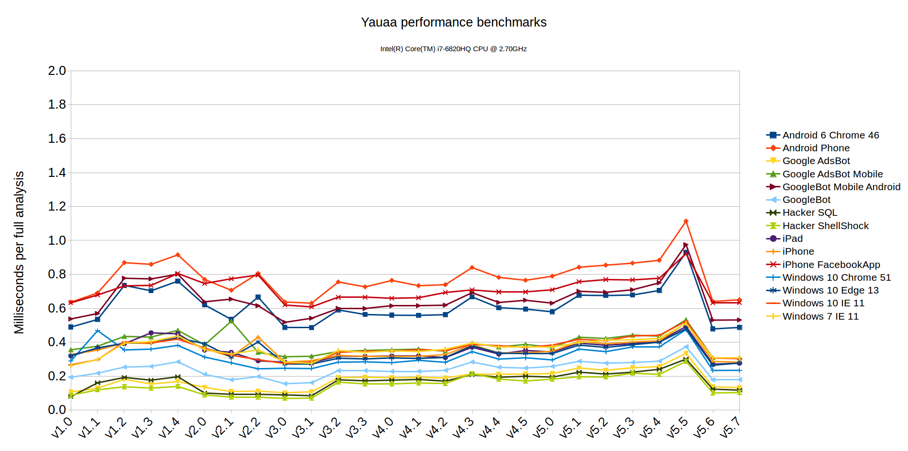
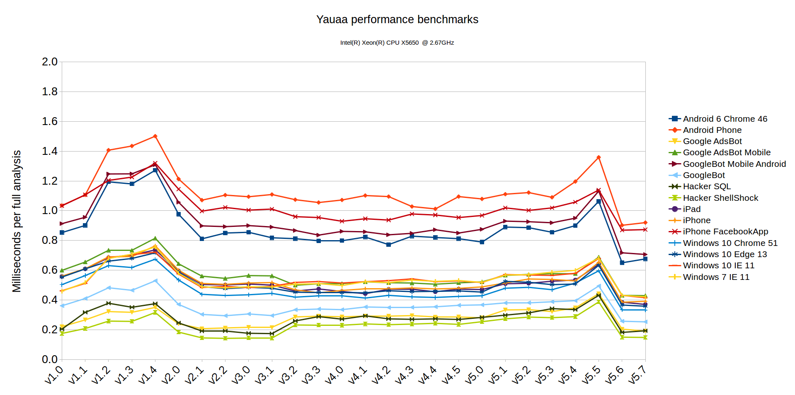

Performance
===========
On my i7 system I see a speed ranging from 500 to 4000 useragents per second (depending on the length and ambiguities in the useragent).
On average the speed is around 2000 per second or ~0.5ms each.
A LRU cache is in place that does over 1M per second if they are in the cache.

Please note that the current system take approx 400MiB of RAM just for the engine (without any caching!!).

Output from the benchmark ( [using this code](https://github.com/nielsbasjes/yauaa/blob/master/benchmarks/src/main/java/nl/basjes/parse/useragent/benchmarks/AnalyzerBenchmarks.java) ) on a Intel(R) Core(TM) i7-6820HQ CPU @ 2.70GHz:

| Benchmark                                 | Mode | Cnt | Score |   | Error | Units |
| ---                                       | ---  | --- | ---  | --- | ---  | ---   |
| AnalyzerBenchmarks.android6Chrome46       | avgt |  10 | 0.499 | ± | 0.016 | ms/op |
| AnalyzerBenchmarks.androidPhone           | avgt |  10 | 0.653 | ± | 0.011 | ms/op |
| AnalyzerBenchmarks.googleAdsBot           | avgt |  10 | 0.135 | ± | 0.001 | ms/op |
| AnalyzerBenchmarks.googleAdsBotMobile     | avgt |  10 | 0.321 | ± | 0.002 | ms/op |
| AnalyzerBenchmarks.googleBotMobileAndroid | avgt |  10 | 0.526 | ± | 0.003 | ms/op |
| AnalyzerBenchmarks.googlebot              | avgt |  10 | 0.180 | ± | 0.005 | ms/op |
| AnalyzerBenchmarks.hackerSQL              | avgt |  10 | 0.116 | ± | 0.001 | ms/op |
| AnalyzerBenchmarks.hackerShellShock       | avgt |  10 | 0.108 | ± | 0.002 | ms/op |
| AnalyzerBenchmarks.iPad                   | avgt |  10 | 0.277 | ± | 0.001 | ms/op |
| AnalyzerBenchmarks.iPhone                 | avgt |  10 | 0.286 | ± | 0.002 | ms/op |
| AnalyzerBenchmarks.iPhoneFacebookApp      | avgt |  10 | 0.650 | ± | 0.003 | ms/op |
| AnalyzerBenchmarks.win10Chrome51          | avgt |  10 | 0.247 | ± | 0.002 | ms/op |
| AnalyzerBenchmarks.win10Edge13            | avgt |  10 | 0.263 | ± | 0.008 | ms/op |
| AnalyzerBenchmarks.win10IE11              | avgt |  10 | 0.310 | ± | 0.005 | ms/op |
| AnalyzerBenchmarks.win7ie11               | avgt |  10 | 0.301 | ± | 0.003 | ms/op |

In the canonical usecase of analysing clickstream data you will see a <1ms hit per visitor (or better: per new non-cached useragent)
and for all the other clicks the values are retrieved from this cache at a speed of < 1 microsecond (i.e. close to 0).

Historical performance
======================
The graph below gives you some insight of how the performance of Yauaa has progressed over time.

You can clearly see the increase in the time needed when adding a lot more rules. 
Also the periodic drops in time needed are clearly visible when a performance improvement was found.

Between version 5.5 and 5.6 a lot of extra rules to detect more brands of mobile devices on Android (causing the needed time to reach ~ 3ms).
Followed by a few steps in a rewrite of that part resulting in effectively the fastest version to date.

In addition I have been able to run (most of) the same benchmarks on a very old Intel Xeon X5650.
According to [cpubenchmark.net](https://www.cpubenchmark.net/compare/Intel-Xeon-X5650-vs-Intel-i7-6820HQ/1304vs2659) this Xeon has only 65% of the single thread speed of the i7.

